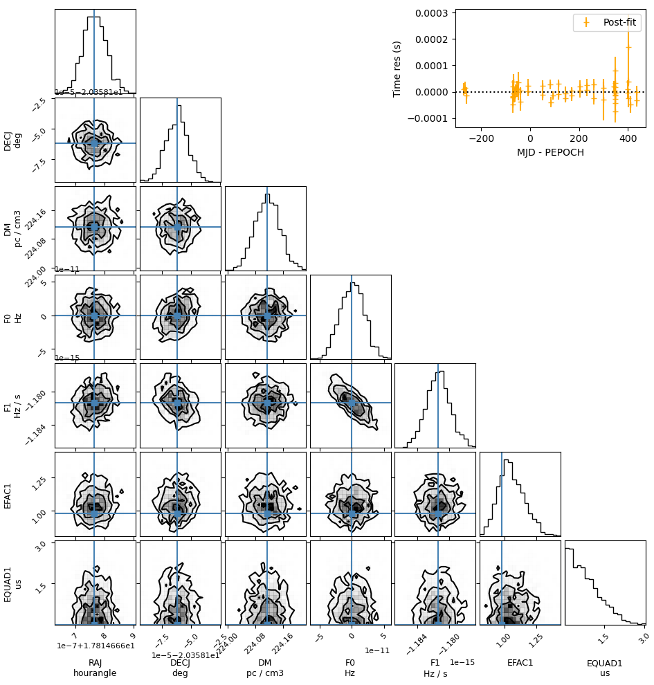

# Command line utilities

The `pyvela` package included a few command line utilities.

## `pyvela` script

The `pyvela` script can be used to do simple analysis runs where fine control over data handling, 
prior distributions, sampler, etc is not necessary. It has the followingb syntax.

```
$ pyvela -h

usage: pyvela [-h] [-J JLSO_FILE] [-P PRIOR_FILE] [--no_marg_gp_noise] [-A ANALYTIC_MARG [ANALYTIC_MARG ...]] [-T TRUTH] [-C CHEAT_PRIOR_SCALE] [-o OUTDIR] [-f] [-N NSTEPS] [-b BURNIN]
              [-t THIN] [-r] [-s INITIAL_SAMPLE_SPREAD]
              par_file tim_file

A command line interface for the Vela.jl pulsar timing & noise analysis package. Uses emcee for sampling. This may not be appropriate for more complex datasets. Write your own scripts for
such cases.

positional arguments:
  par_file              The pulsar ephemeris file. Should be readable using PINT. The uncertainties listed in the file will be used for 'cheat' priors where applicable.
  tim_file              The pulsar TOA file. Should be readable using PINT. Either this or a JLSO file (-J) should be provided.

options:
  -h, --help            show this help message and exit
  -J JLSO_FILE, --jlso_file JLSO_FILE
                        The JLSO file containing pulsar timing and noise model & TOAs created using `pyvela-jlso`. JLSO files may need to be recreated after updating `Vela.jl` since the
                        data format may change. These files are faster to read and parse. (default: None)
  -P PRIOR_FILE, --prior_file PRIOR_FILE
                        A JSON file containing the prior distributions for each free parameter. (Ignored if `-J` option is used.) (default: None)
  --no_marg_gp_noise    Don't analytically marginalize the correlated Gaussian noise amplitudes. (default: False)
  -A ANALYTIC_MARG [ANALYTIC_MARG ...], --analytic_marg ANALYTIC_MARG [ANALYTIC_MARG ...]
                        Parameters to analytically marginalze (only some parameters are allowed). (default: [])
  -T TRUTH, --truth TRUTH
                        Pulsar ephemeris file containing the true timing and noise parameter values. Relevant for simulation studies. (default: None)
  -C CHEAT_PRIOR_SCALE, --cheat_prior_scale CHEAT_PRIOR_SCALE
                        The scale factor by which the frequentist uncertainties are multiplied to get the 'cheat' prior distributions. (default: 100)
  -o OUTDIR, --outdir OUTDIR
                        The output directory. Will throw an error if it already exists (unless -f is given). (default: pyvela_results)
  -f, --force_rewrite   Force rewrite the output directory if it exists. (default: False)
  -N NSTEPS, --nsteps NSTEPS
                        Number of ensemble MCMC iterations (default: 6000)
  -b BURNIN, --burnin BURNIN
                        Burn-in length for MCMC chains (default: 1500)
  -t THIN, --thin THIN  Thinning factor for MCMC chains (default: 100)
  -r, --resume          Resume from an existing run (default: False)
  -s INITIAL_SAMPLE_SPREAD, --initial_sample_spread INITIAL_SAMPLE_SPREAD
                        Spread of the starting samples around the default parameter values. Must be > 0 and <= 1. 0 represents no spread and 1 represents prior draws. (default: 0.3)
```

This command created saves the MCMC chain and related metadata into an output directory. This includes the following files. The parameter order in all of these files is the same.

  - `summary.json`: A `JSON` file containing information about the inputs and the system environment. Useful for debugging.
  - The input `par` and `tim` files
  - The "truth" `par` file (optional, only relevant for simulations)
  - The input `JSON` file containing user defined priors.
  - `prior_info.json`: `JSON` file containing the prior distribution for all parameters, including user-defined, default, and 'cheat' priors.
  - `samples.npy`: The `numpy` format file containing the flattened and burned-in MCMC chain. This can be read using [`numpy.load()`](https://numpy.org/doc/stable/reference/generated/numpy.load.html).
  - `samples_raw.npy`: Same as `samples.npy`, but the quantities here are in `Vela.jl`'s internal units.
  - `param_names.txt`: An ordered list of free model parameter names following the `PINT` conventions.
  - `param_prefixes.txt`: An ordered list of free model parameter prefixes following the `PINT` conventions.
  - `param_scale_factors.txt`: An ordered list of scale factors which convert parameter values from `PINT` units to `Vela.jl`'s internal units. The values in `samples.npy` and `samples_raw.npy` are related by these scale factors.
  - `params_median.txt`: The posterior median sample estimated from the MCMC chain
  - `params_std.txt`: The parameter standard deviations estimated from the MCMC chain
  - `param_units.txt`: Parameter units represented as `astropy.units`-compatible strings. Empty rows represent dimensionless quantities.
  - `param_default_values.txt`: "Pre-fit" values taken from the input par file.
  - `param_autocorr.txt`: MCMC autocorrelation length for each free parameter.
  - `<PSR>.median.par`: A "post-fit" `par` file containing the posterior median values taken from the MCMC chain.
  - `residuals.txt`: Post-fit residuals computed using the posterior median values.
  - `prior_evals.npy`: The prior distributions evaluated within the posterior distribution range. Used for plotting.
  - `prior_info.json`: A `JSON` file containing information about *all* prior distributions used for the analysis.
  - A `JLSO` file that serializes the `SPNTA` object.
  - `chain.h5`: HDF5 file containing all samples.

## `pyvela-plot` script

Creates a [`corner`](https://corner.readthedocs.io/en/latest/) plot from a directory containing the output of the `pyvela` script.
The plots are *not* publication-quality.

```
$ pyvela-plot -h

usage: pyvela-plot [-h] [-I IGNORE_PARAMS [IGNORE_PARAMS ...]] result_dir

Create a corner plot from pyvela results.

positional arguments:
  result_dir            A directory containing the output of the `pyvela` script.

options:
  -h, --help            show this help message and exit
  -I IGNORE_PARAMS [IGNORE_PARAMS ...], --ignore_params IGNORE_PARAMS [IGNORE_PARAMS ...]
                        Parameters to exclude from the corner plot.
```

The output looks like this:


## `pyvela-jlso` script

Creates a [`JLSO`](https://invenia.github.io/JLSO.jl) file that is a serialization of the `Vela.TimingModel` and `Vector{Vela.TOA}` objects
from a pair of `par` and `tim` files and optionally a prior file. This is useful for reducing the input reading overhead while running repeated
analyses on the same input files. The resulting `JLSO` file can be passed on to the `pyvela` script through the `-J` option.

```
$ pyvela-jlso -h

usage: pyvela-jlso [-h] [-P PRIOR_FILE] [-C CHEAT_PRIOR_SCALE] -o OUTFILE par_file tim_file

Read a par file, tim file, and prior JSON file, and write a JLSO file.

positional arguments:
  par_file              The pulsar ephemeris file. Should be readable using PINT. The uncertainties listed in the file will be used for 'cheat' priors where applicable.
  tim_file              The pulsar TOA file. Should be readable using PINT.

options:
  -h, --help            show this help message and exit
  -P PRIOR_FILE, --prior_file PRIOR_FILE
                        A JSON file containing the prior distributions for each free parameter.
  -C CHEAT_PRIOR_SCALE, --cheat_prior_scale CHEAT_PRIOR_SCALE
                        The scale factor by which the frequentist uncertainties are multiplied to get the 'cheat' prior distributions.
  -o OUTFILE, --outfile OUTFILE
                        The output file name. Will replace an existing file.
```
