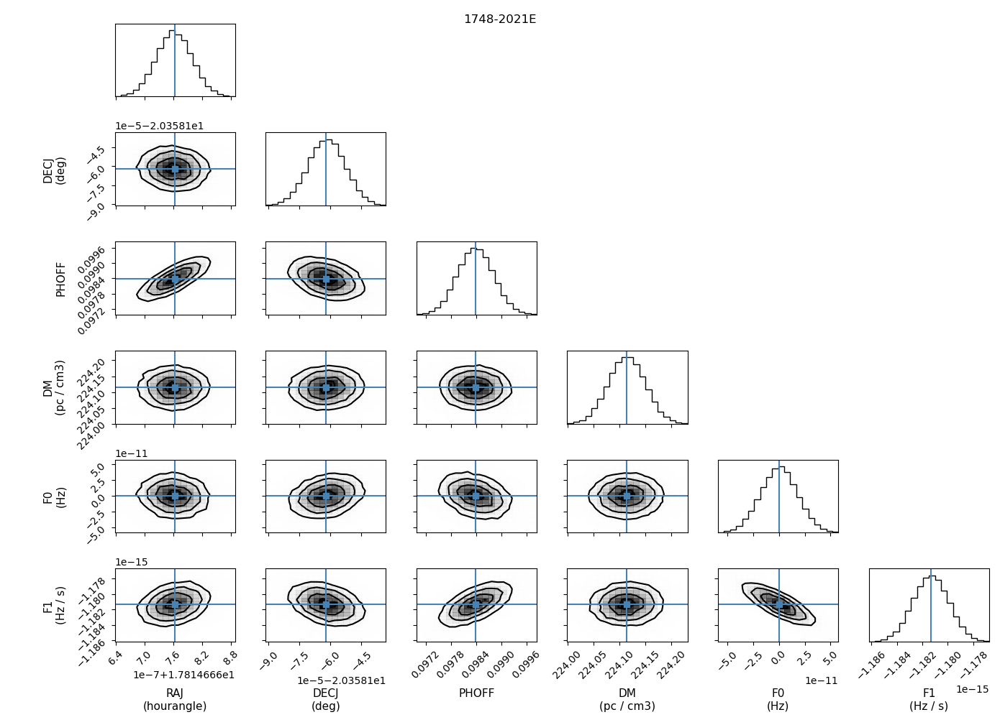

# Getting started: The `pyvela` interface

`Vela.jl` must interact with Python for three reasons: (1) most pulsar astronomers are more 
familiar with Python than Julia (2) Python has many samplers that have no counterpart in 
Julia, and most importantly, (3) it is a real pain to implement `par` and `tim` file readers.

The `pyvela` interface is demonstrated below using an example with the `emcee` sampler.

## Reading `par` and `tim` files using the `SPNTA` class

While the `par` file format is outwardly simple, it is rife with special cases and arbitrary units,
and reconstructing a timing & noise model from a `par` file is pretty hard. The `tim` files are
kind of easier to handle, but there are multiple `tim` file formats and some datasets can have
multiple format TOAs in the same file. So we are not re-inventing the wheel and instead using
`PINT` to do this. This also has the advantage of not having to implement clock corrections and
solar system ephemeris calculations.

Here is how we read read a pair of `par` and `tim` files in `pyvela`:
```
from pyvela import SPNTA, Vela as vl
from juliacall import Main as jl
import numpy as np

jl.seval("using Distributions")

parfile, timfile = "NGC6440E.par", "NGC6440E.tim"
spnta = SPNTA(
    parfile, 
    timfile,
    cheat_prior_scale=5,
    custom_priors={
        "PHOFF": jl.Uniform(-0.5, 0.5)
    }
)
```
Here, `spnta.model` is a `Vela.TimingModel` object and `spnta.toas` is a `Vector{Vela.TOA}` object. The `SPNTA` class
function reads the `par` and `tim` files using the
[`pint.models.get_model_and_toas`](https://nanograv-pint.readthedocs.io/en/latest/_autosummary/pint.models.model_builder.get_model_and_toas.html) 
function under the hood and converts the resulting `pint.models.TimingModel` and `pint.toa.TOAs` objects. Note that this conversion does 
not conserve all the information, and the reverse is not possible. 

`cheat_prior_scale` defines the scale factor by which the frequentist uncertainties are multiplied to 
obtain the "cheat" prior widths. The `custom_priors` argument contains the user-defined prior distributions, 
which should be instances of the  `Distributions.UnivariateDistribution` type. It supports both parameter names 
and prefixes as dict keys. For example, if an entry for "EFAC" is present, it will set the prior for all 
EFAC parameters. If "EFAC1" is present, it will set the prior for EFAC1 specifically. If both "EFAC" and 
"EFAC1" are present, the latter sets the prior for EFAC1, whereas the former sets the priors for all other EFACs. 
In the above example, the priors for all parameters except "PHOFF" are set using "cheat" priors.

The `custom_priors` argument also accepts a filename (`str`) or an `IO` object containing a `JSON` representation of 
the priors. See [Representing priors in a `JSON` file](@ref) for more details.

Everything defined in `Vela.jl` will be available through the `vl` namespace above, e.g., `vl.TimingModel` 
and `vl.TOA`. Things that were explicitly imported into `Vela.jl` are also available, e.g., `vl.GQ` is the `GQ` type 
from `GeometricUnits.jl`. Other things from Julia are accessed using the `juliacall` package.

The `SPNTA` object created above has attributes `lnlike`, `lnprior`, `prior_transform`, `lnpost`, and 
`lnpost_vectorized`. These provide the log-likelihood, log-prior, prior transform, and log-posterior 
functions which call `Vela.jl` under the hood. The difference between `spnta.lnpost` and 
`spnta.lnpost_vectorized` is that if multiple threads are allowed (by setting the `PYTHON_JULIACALL_THREADS`
environment variable), `spnta.lnpost` parallelizes a single log-posterior computation across TOAs, whereas
`spnta.lnpost_vectorized` computes the log-posterior at multiple points in the parameter space parallelly.
The latter can be used with samplers such as `emcee` and `zeus`. Make sure not to set `PYTHON_JULIACALL_THREADS` 
to a value greater than the number of available CPU cores.

The `SPNTA` object also has useful attributes such as the number of free parameters (`ndim`), the free parameter
names (`param_names`), free parameter labels including units (`param_labels`), scale factors for converting to and
from the `Vela.jl` internal units (`scale_factors`), and the default parameters read from the `par` file (`maxlike_params`).
The `rescale_samples()` function rescales the samples from `Vela.jl` internal units to the usual units used
in pulsar astronomy.

Now, let us see if `lnpost` actually works.
```
print(spnta.lnpost(spnta.maxlike_params))
```

Similarly,
```
print(
    spnta.lnpost_vectorized(
        np.array([spnta.maxlike_params])
    )
)
```

## Setting up the sampler
```
import emcee

nwalkers = spnta.ndim * 5
p0 = np.array([spnta.prior_transform(cube) for cube in np.random.rand(nwalkers, spnta.ndim)])

sampler = emcee.EnsembleSampler(
    nwalkers,
    spnta.ndim,
    spnta.lnpost_vectorized,
    moves=[emcee.moves.StretchMove(), emcee.moves.DESnookerMove()],
    vectorize=True,
)
```
`p0` contains a number of random draws from the prior distribution. Note the `vectorize=True`
while creating the sampler. This should be given if we are using the vectorized log-posterior.

In practice, the `moves` should be optimized based on the problem at hand.
 
## Running MCMC
```
sampler.run_mcmc(p0, 6000, progress=True)
```
This will only take a few seconds because the dataset is very small. Larger datasets may take
minutes or hours depending on the size and the computing power available.

```
samples_v_0 = sampler.get_chain(flat=True, discard=1000, thin=50)
```
This flattens the multiple chains `emcee` was running. Also note the burn-in (`discard`) 
and the thinning.

```
samples_v = spnta.rescale_samples(samples_v_0)
```
This converts the samples into the usual units used in pulsar astronomy.

## Printing out the results
```
means = np.mean(samples_v, axis=0)
stds = np.std(samples_v, axis=0)
for idx, (pname, mean, std) in enumerate(zip(spnta.param_names, means, stds)):
    if pname == "F0":
        F0_ = np.longdouble(spnta.model.param_handler._default_params_tuple.F_.x)
        print(f"{pname}\t\t{mean + F0_}\t\t{std}")    
    else:
        print(f"{pname}\t\t{mean}\t\t{std}")
```
Recall that the F0 value is stored as a sum of two `Float64`s. The special case in the `if`
block combines these parts back together.

## Plotting
```
import corner
import matplotlib.pyplot as plt

fig = corner.corner(
    samples_v,
    labels=spnta.param_labels,
    label_kwargs={"fontsize": 11},
    range=[0.999] * spnta.ndim,
    plot_datapoints=False,
    hist_kwargs={"density": True},
    labelpad=0.3,
)
plt.suptitle(spnta.model.pulsar_name)
plt.tight_layout()
plt.show()
```

The output looks something like this:


Note that the F0 plot is centered around 0. This is because F0 is split into 
the sum of a large number and a small number to have more numerical precision, 
and only the smaller part is treated as a free parameter. See [Quantities](@ref)
for more details.